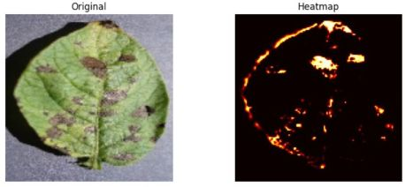
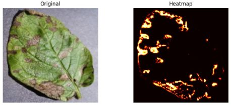

# 🌾 Monitoring Crop Health using Computer Vision

This project simulates an AI-powered drone system that uses computer vision to monitor crop health by identifying unhealthy or diseased regions in aerial images.

---

## 🎯 Objective

- Detect **unhealthy crop regions** from aerial/surface images using deep learning.
- Train a **U-Net segmentation model** to classify each pixel as healthy or unhealthy.
- Visualize predictions as **heatmaps**.

---

## 📂 Folder Structure

```
project-root/
│
├── data/                 # Sample test images
├── models/               # Saved U-Net model
├── notebooks/
│   ├── training.ipynb    # Model training code (Kaggle)
│   └── inference.ipynb   # Run model on test images
├── src/
│   └── utils.py          # Preprocessing and helpers
└── README.md             # Project summary
```

---

## 🧠 Model Summary

- **Model:** U-Net
- **Framework:** TensorFlow 2
- **Input size:** 128×128 RGB
- **Output:** Binary mask (healthy/unhealthy)

---

## 🗃 Dataset

Used a subset of the [New Plant Diseases Dataset (Kaggle)](https://www.kaggle.com/datasets/vipoooool/new-plant-diseases-dataset).  
Classes used:
- `Apple___healthy`
- `Apple___Black_rot`

---

## ⚙️ How to Run

### On Kaggle:
1. Attach model + test image folders.
2. Run `inference.ipynb`
3. Outputs: original image + heatmap

---

## 📊 Training Summary

- Epochs: 20 * 5 
- Accuracy: ~99.6%  
- Loss: ~0.007 

---

## 📈 Visualization

- Shows heatmap of unhealthy crop regions

---

## 🔍 Results & Heatmap Visualization

Below are some sample predictions from the trained model.

The model accurately highlights unhealthy crop regions as shown in the generated heatmaps:
|  |
|  |

---

## 👨‍💻 Authors

- Bidyut Supakar  

